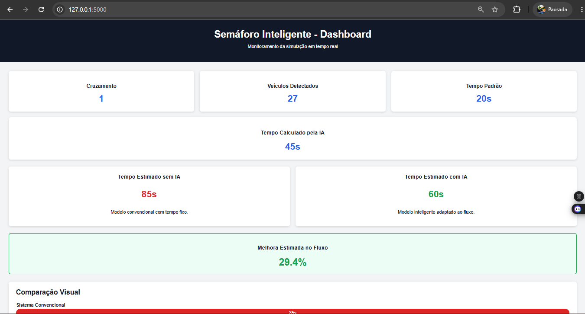
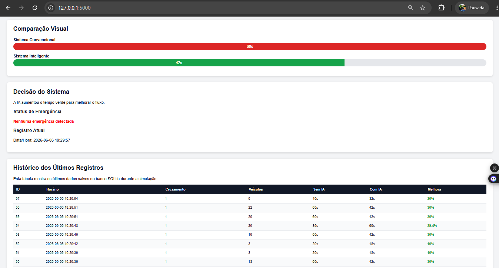

# TCC - Semáforo Inteligente com Inteligência Artificial

Projeto acadêmico desenvolvido para o Trabalho de Conclusão de Curso, com o objetivo de criar uma maquete funcional de um sistema inteligente de controle semafórico urbano.

O sistema utiliza Python, Flask, banco de dados SQLite, visão computacional, Inteligência Artificial e RFID para simular o funcionamento de semáforos inteligentes em cruzamentos urbanos.

---

## Objetivo do Projeto

Desenvolver um sistema capaz de:

- detectar a quantidade de veículos em um cruzamento;
- calcular o tempo ideal de abertura do semáforo;
- comparar o funcionamento de um semáforo convencional com um semáforo inteligente;
- registrar os dados no banco de dados;
- exibir as informações em um dashboard;
- futuramente integrar câmera, ESP32 e RFID.

---

## Tecnologias Utilizadas

### Linguagens

- Python
- HTML
- CSS
- JavaScript
- SQL

### Bibliotecas e Ferramentas

- Flask
- SQLite
- OpenCV
- Scikit-learn
- Pandas
- Matplotlib
- PySerial

### Hardware Planejado

- ESP32
- Webcam USB
- RFID RC522
- Tags RFID
- LEDs vermelho, amarelo e verde
- Protoboard
- Resistores
- MDF para a maquete
- Miniaturas Hot Wheels

---

## Funcionalidades Atuais

Atualmente o projeto possui:

- dashboard local desenvolvido com Flask;
- simulação de quantidade de veículos;
- cálculo inicial do tempo do semáforo conforme o fluxo;
- comparação entre semáforo convencional e sistema inteligente;
- cálculo de melhora estimada;
- registro automático no banco SQLite;
- histórico dos últimos registros no dashboard.

Nesta fase, os dados de veículos ainda são simulados. Essa escolha foi feita para validar primeiro o dashboard, o banco de dados e a lógica de decisão. Nas próximas etapas, os dados simulados serão substituídos pela contagem real feita por câmera com OpenCV.

---

## Dashboard do Sistema

As imagens abaixo mostram a primeira versão funcional do dashboard do projeto.

### Visão geral do dashboard



### Histórico e comparação dos dados



---

## Como Rodar o Projeto

### 1. Clonar o repositório

```bash
git clone https://github.com/PabloKn663/tcc-semaforo-inteligente.git