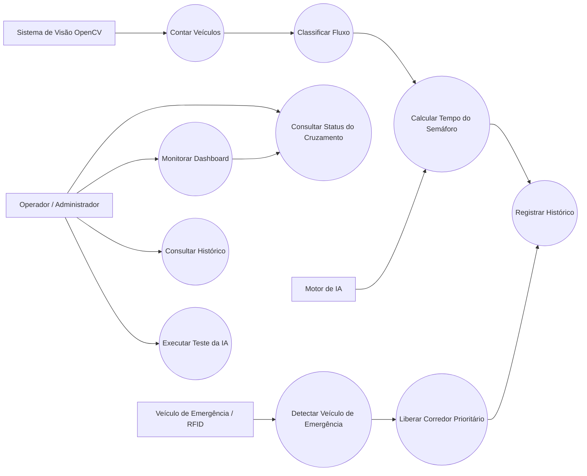

# Diagrama de Casos de Uso UML

## Descrição dos Atores

### Operador / Administrador

Representa a pessoa responsável por acompanhar o funcionamento do sistema por meio do dashboard. Esse ator pode visualizar os dados do cruzamento, consultar o histórico, acompanhar as decisões da IA e validar os testes realizados no protótipo.

### Sistema de Visão OpenCV

Representa o módulo responsável pela contagem de veículos por visão computacional. Nesta etapa, a contagem ainda é simulada, mas o projeto prevê a integração com câmera e OpenCV para capturar dados reais da maquete.

### Veículo de Emergência / RFID

Representa o veículo prioritário da maquete, como ambulância, viatura ou carro de bombeiro. A identificação será realizada por meio de uma tag RFID, permitindo que o sistema reconheça a necessidade de prioridade.

### Motor de IA

Representa o modelo de Inteligência Artificial baseado em Árvore de Decisão. Ele recebe informações como quantidade de veículos, presença de emergência e horário de pico, retornando o tempo recomendado para abertura do semáforo.

## Detalhamento dos Casos de Uso

| Código | Caso de Uso                    | Descrição                                                                                                    |
| ------ | ------------------------------ | ------------------------------------------------------------------------------------------------------------ |
| UC01   | Monitorar Dashboard            | Permite acompanhar os dados do sistema em tempo real por meio da interface web.                              |
| UC02   | Consultar Status do Cruzamento | Exibe informações como quantidade de veículos, tempo padrão, tempo calculado pela IA e status de emergência. |
| UC03   | Contar Veículos                | Representa a contagem de veículos no cruzamento, inicialmente simulada e futuramente realizada com OpenCV.   |
| UC04   | Classificar Fluxo              | Classifica o trânsito como baixo, normal, alto ou intenso.                                                   |
| UC05   | Calcular Tempo do Semáforo     | Utiliza o modelo de IA para definir o tempo recomendado de abertura do semáforo.                             |
| UC06   | Registrar Histórico            | Salva no banco de dados os registros gerados durante a simulação.                                            |
| UC07   | Detectar Veículo de Emergência | Identifica a presença de veículo prioritário por meio de simulação ou RFID.                                  |
| UC08   | Liberar Corredor Prioritário   | Ajusta o comportamento do semáforo para priorizar a passagem do veículo de emergência.                       |
| UC09   | Consultar Histórico            | Permite visualizar os últimos registros salvos pelo sistema.                                                 |
| UC10   | Executar Teste da IA           | Permite validar o modelo treinado com diferentes cenários de entrada.                                        |
